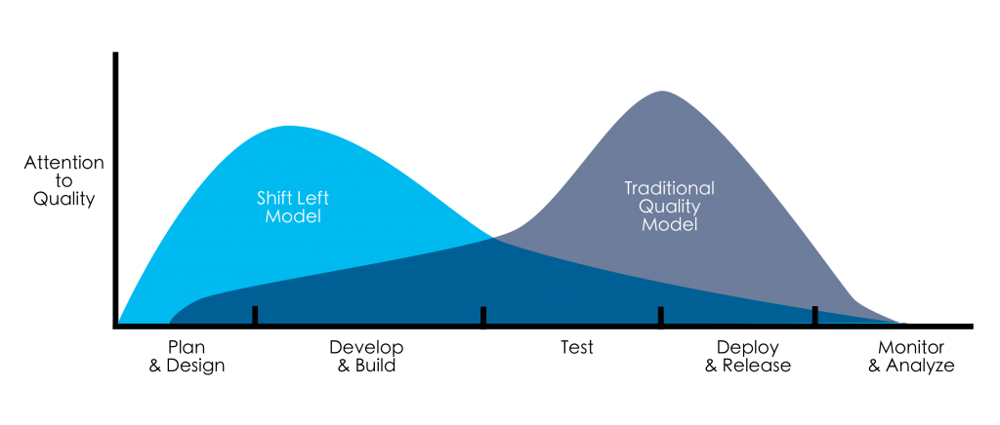

# Baton

Baton is a lean, manager-led orchestration skill for **Claude Code**, with an optional TypeScript runtime on the [Claude Agent SDK](https://code.claude.com/docs/en/agent-sdk/overview). Like a relay team, it routes development work through bounded, parallel subagent lanes (triage, discovery, planning, implementation, verification, recovery), handing off cleanly while a single coordinator owns integration, approval gates, and an auditable run trail. The point is consistency and independent verification that catches what green tests miss, not a smarter model. **Lean by default** for solo work; to make **your process repeatable**, encode your team's review, deploy, and acceptance steps in `references/` once, and Baton follows them across every project.

## Executive summary (plain English)

**Baton** is a skill for Claude Code (an AI that writes code), following the open [Agent Skills](https://agentskills.io/home) standard.

Think of a relay race. The work is the baton, passed cleanly from one runner to the next:

- one **looks around the code** to learn how it works
- one **makes a plan**
- one **writes the code**
- one **checks the work** and looks for mistakes the tests miss
- one **looks things up** when the team gets stuck

A **coordinator** hands the baton to each runner, keeps them out of each other's way, and brings the work back together. It asks you first before anything big or hard to undo, like sharing code or deleting files. You stay in charge, and it keeps short notes on what it did.

You can teach Baton your own rules (your review steps, deploy checks, ticket conventions) by adding a few files, so the same process repeats on every project. Simple for one person, and it still fits a big team.

Baton uses more of the AI's effort than a single prompt, because it runs several helpers per job. In return you get a steady, checked process on every run, and you do not have to keep track of every handoff yourself.

## Shift-left by design



Baton's loop is shaped like the shift-left curve: it concentrates attention on quality **early**, with discovery before touching code, a planning pass, reading the surrounding code to match its conventions, and verification before work is called done. The economics are the classic ones: a defect caught at _Plan_ or _Develop_ is far cheaper than the same defect caught at _Test_, _Deploy_, or in production.

That early investment is a **cost**. It pays back only when there's an expensive "late" to prevent, which is why it earns its keep on consequential work. The point isn't _more turns up front_; it's **earlier attention, in proportion to risk**. The edge over a bare model isn't that Baton can plan ahead (any capable model can); it's that Baton shifts left **reliably, on every routed run**, instead of only when the task and model happen to prompt it.

Scope note: out of the box Baton is shift-**left**. It owns **Plan → Develop → Test** and _gates_ (rather than runs) anything outward-facing. The right side isn't a hard wall, though. Encode your **Deploy & Release** process in [`references/`](.claude/skills/baton/references/), along with point-in-time **Monitor & Analyze** checks (post-deploy health, smoke tests, acceptance), and Baton will sequence, gate, and verify those steps as part of the loop. What stays out is _execution_, not coverage: Baton still won't fire an irreversible deploy without your approval or act as a live production monitor. It drives the process you define and leaves the trigger to you or your pipeline.

## How the loop works

Substantial work runs the loop; trivial work skips it and runs direct.

```
 intake → triage ─┬─ direct ───→ make the change · verify · done
                  │
                  └─ delegated → plan → implement → verify ─┬─ pass → approve → close out
                                        (lanes)             │
                                                            └─ fail → recover ──┐
                                                              ≈2 focused tries   │
                                                              on the failing     │
                                                              surface, then  ◀───┘
                                                              escalate to you
```

Lanes are bounded runners with **disjoint write scopes** that report back to the one coordinator, never to each other:

`discovery·Explore` · `planning·Plan` · `implementation·implementer` · `review·code-reviewer` · `research·researcher`

The coordinator owns integration, approval, and the run trail. The `recover` bound (~2 focused attempts, then escalate) is evidence-informed; see [Why it's built this way](#why-its-built-this-way).

Under the hood this maps onto Claude Code's native subagent system (the Agent tool with `subagent_type`, `run_in_background`, `SendMessage`, worktree isolation, and plan mode), trimmed to development concerns.

## Examples (simple → complex)

Invoke it in Claude Code with `/baton <task>`:

```text
# trivial: runs direct, no lanes, no ceremony
/baton fix the typo in the README

# one delegated lane: implement, with review split out
/baton plan and implement this feature, splitting verification into its own lane

# discovery-first: reduce guessing before touching code
/baton do a discovery pass on this repo before we touch the auth flow

# read-only gate: review without letting it change code
/baton have a reviewer check this diff and run the tests; it must not edit anything

# fully routed: design, parallel implementation, review at the end
/baton route this change: design in one lane, implementation in another, review at the end
```

## Recommended workflow

For consequential work, the practice that holds up in real use is:

1. **Plan the feature and the implementation together.** Decide what the feature does and how it will be built in one planning pass: module boundaries, the conventions and contracts it must match, and a sliced work plan. Planning the build alongside the feature is what lets discovery surface the unstated rules (error types, naming, idempotency) before any code is written.
2. **Implement against that plan**, matching the surrounding code.
3. **Review with an independent, focused pass.** A single review on clean inputs misses what a differently-briefed one catches. The strongest pattern is a focused review from a **separate coding-agent session** (a fresh context with its own brief), not just the lane that implemented the change. In practice this means: hand a reviewer a scoped brief (target, what is already covered, what to pressure-test) and have it verify behaviorally, executing adversarial and edge inputs rather than re-reading the diff.

Baton runs this as its loop (plan, implement, verify), but the independent-review step pays off most when the reviewer is genuinely separate. If your project has a dedicated review skill installed (for example `/code-review`, `/security-review`), route consequential reviews to it from your project's root `AGENTS.md`; the manager reads that as repo guidance and follows it. The built-in `code-reviewer` lane is the portable floor.

## What's in here

The skill is **self-contained**. Everything lives in one folder:

```
.claude/skills/baton/
├── SKILL.md                 # the orchestrator skill (loop, delegation, lane map)
├── references/README.md     # org SDLC extension point (Workflow/Platform/Acceptance/Security)
├── evals/evals.json         # 12 capability eval cases
├── agents/                  # canonical lane prompts
│   ├── triage.md            # size/risk triage → disposition (read-only)
│   ├── implementer.md       # bounded implementation lane (disjoint write scope)
│   ├── code-reviewer.md     # verification/review lane (read-only)
│   └── researcher.md        # focused research / recovery investigation (read-only)
└── runtime/                 # OPTIONAL programmatic execution engine (headless)
    ├── src/orchestrator.ts  # coordinator query() loop
    ├── src/lanes.ts         # loads agents/*.md as programmatic AgentDefinitions
    ├── src/offline.ts       # deterministic repo detection (no model call)
    ├── src/ledger.ts        # opt-in run ledger (run.json + summary.md when BATON_LEDGER_DIR set)
    ├── src/mcp.ts           # optional MCP passthrough loader
    ├── mcp.example.json     # ready-to-use Serena MCP template (opt-in)
    └── scripts/             # install.sh + eval runner (run-evals.mjs, validate-evals.mjs)
```

Baton needs no server, no database, no control plane, and no new runtime to learn. It is a markdown skill (plus an optional Node runtime), copied into a repo. That is the whole footprint.

## Install

**Per project.** Copy the folder into the repo you're working in:

```bash
cp -r .claude/skills/baton <repo>/.claude/skills/
```

The `/baton` command is then available in that repo.

**Global (all projects).** Install once into your personal Claude config:

```bash
cp -r .claude/skills/baton ~/.claude/skills/        # skill: available everywhere
bash ~/.claude/skills/baton/runtime/scripts/install.sh ~   # lanes → ~/.claude/agents/
```

| What                  | Where it goes                                                     | Notes                                                                                                                                                          |
| --------------------- | ----------------------------------------------------------------- | -------------------------------------------------------------------------------------------------------------------------------------------------------------- |
| **Skill** (`/baton`)  | `.claude/skills/baton/` (project) or `~/.claude/skills/` (global) | Global is found in every project; on a name clash, the personal copy wins.                                                                                     |
| **Lanes** (subagents) | `.claude/agents/` (project) or `~/.claude/agents/` (global)       | Needed for **interactive** use only. Subagents don't resolve from inside a skill folder; the runtime registers them in-process, so headless doesn't need this. |

## Using it

**Interactive Claude Code (the main way).** Install the skill (above), then invoke it in any project:

```text
/baton <task>
```

The main conversation becomes the coordinator and runs the loop. For most people, that's the whole product, with no setup beyond the install.

### Optional: headless runtime (local batch · CI/CD · cloud)

The bundled TypeScript runtime runs the **same loop without an interactive session**, for scripted, CI/CD, or cloud use. You don't need it for normal interactive work.

```bash
cd .claude/skills/baton/runtime
npm install
cp .env.example .env        # add ANTHROPIC_API_KEY (loaded automatically)
npm run orchestrate -- "plan and implement X" --cwd /path/to/target/repo
```

**Execution modes:**

- **LLM-backed (default).** Real model calls drive the coordinator and lanes. Needs `ANTHROPIC_API_KEY` (or a supported provider).
- **Deterministic offline** (`--offline`, or automatic with no key). A no-model pass: reads the repo, prints the detected profile and lane registry, exits. A free dry run / CI smoke check.

```bash
npm run orchestrate -- "discovery pass" --cwd /path/to/target/repo --offline
```

**Cost** (LLM-backed): the coordinator loop dominates, so it defaults to **Sonnet at medium effort** with a 40-turn cap. Tune via env (`.env.example`): `BATON_MODEL=haiku BATON_EFFORT=low` for low-cost runs, `BATON_MODEL=opus BATON_EFFORT=xhigh` for the hardest work. Lanes keep their own models (triage→haiku, reviewer/researcher→sonnet, implementer→inherits the coordinator). Adding _more tools_ does **not** lower cost. Model tier, effort, and bounded turns do.

**Run trail:** the run summary and cost (`total_cost_usd`) print to stdout on every run. The ledger is **opt-in**. Set `BATON_LEDGER_DIR` to also persist `run.json` + `summary.md` under that directory (e.g. `~/.baton/runs` for global history, or an in-tree, gitignored path); unset, no files are written.

**Optional semantic navigation:** point `BATON_MCP_CONFIG` at an MCP server (e.g. Serena; template in `runtime/mcp.example.json`) for symbol-aware code navigation. Off by default; install the server yourself only if you opt in.

## Make it yours

Baton is generic out of the box. Two folders are meant to be **adapted to your context**:

- **`references/`**: your org's SDLC, like ticketing/PR conventions, platform/deploy, acceptance gates, security posture. The coordinator consults the relevant one on demand; with none, it stays generic. See [`references/README.md`](.claude/skills/baton/references/README.md).
- **`evals/`**: Baton's 12 built-in capability cases encode what good orchestration _looks like_ (route vs. act direct, read-only review lanes, gated outward actions, recover-not-declare-done). Check structure with `npm run validate-evals` (no key); run live, LLM-judged, with `npm run evals`. **Add your own SDLC cases** in a `baton.evals.json` at your repo root (or point `BATON_EVALS` at any path): the runners merge it with the built-ins (new ids append, a matching id overrides), so your cases stay _yours_ and survive a skill update. Tie them to your `references/` gates (e.g. assert "checks `Acceptance.md` before declaring done") so "done" means what it means for your team. The repo's own [`baton.evals.json`](baton.evals.json) is a working example.

The live eval suite is **exploratory**: abstract prompts on empty workspaces don't yield a clean pass/fail, so treat `validate-evals` (structural) as the CI gate and live runs as a sanity check until you add fixtures for your own cases.

## Security & trust

Baton orchestrates an AI agent, and is plain about what that means:

- **It runs an agent with real tools.** Interactively it uses Read/Edit/Write/Bash within Claude Code's permission model; the headless runtime defaults to `acceptEdits` (edits apply without prompts) so it can work unattended. Run it on code you're willing to let an agent change.
- **Hardening headless / CI runs.** Because the runtime defaults to `acceptEdits`, run it where unattended edits are safe: a sandboxed container or ephemeral CI job, on a fresh checkout or a git worktree it cannot escape. Give it a dedicated, least-privilege `ANTHROPIC_API_KEY` (or provider role) scoped to the pipeline, and rotate it. Even headless, outward-facing actions stay refused: the runtime does the reversible work and reports pushes, PRs, and deletions as follow-ups rather than performing them.
- **Outward-facing actions are approval-gated.** Push, PRs, ticket changes, deletions, and destructive rollbacks wait for your explicit OK, and you stay the credited author.
- **The optional MCP passthrough launches a local command** you configure (e.g. Serena) with your privileges, so point `BATON_MCP_CONFIG` only at servers you trust. Off by default.
- **No telemetry.** Baton makes model calls (and any MCP server you add) and writes a local run ledger; nothing else leaves your machine.

## Composing with other Claude Code features

Baton stays loosely coupled: it depends on no other skill, and composition is steered from your project, not baked into Baton:

- **Specialist skills.** Baton prescribes nothing about other skills. If you want the coordinator to route a lane to a skill you've installed (e.g. `code-review`, `security-review`, `deep-research`), say so in your project's root `AGENTS.md`; the manager reads it as repo guidance and follows it (long-running ones as background lanes).
- **Hooks.** Put automated, repeatable gates ("always run tests before done") in `settings.json` hooks, not in prose.
- **`/loop`.** Wrap a routed run for recurring/scheduled execution.

## Why it's built this way

Key design choices (manager-led lanes, behavioral verification, the ~2-round recovery bound, the low-cost-model default, the multi-agent bet) draw on published code-translation research, adapted to real dev work rather than copied from it. We're clear about which the evidence directly supports and which are pragmatic calls, kept flexible by intent and refined as we learn. The decision-by-decision mapping of what we took, where we adapted it, and what's open is in [`docs/research-basis.md`](docs/research-basis.md). Those results support the design **by analogy**, not as proof; Baton's own evals and live runs are the primary evidence.

**What the bench shows.** A Baton-vs-baseline bench (`testing/fixtures/`, skill-on vs. `--no-skill`) ran four times across model tiers and difficulty, and **every run washed**: structured and unstructured produced equal end-state outcomes, at higher cost for Baton. Baton does **not** beat a capable model on small, low-stakes correctness. Its value is **reliably vs. probabilistically**. It _always_ verifies, gates outward-facing actions, splits review into its own lane, and keeps a run trail, where a bare model does these only when the task and model happen to favour it. Add scale, skill-composition, and accessibility, none of which a single-model toy bench can measure. Full reasoning in [`docs/research-basis.md`](docs/research-basis.md#where-we-drifted--and-whats-still-open).

**When it helps.** On small, self-contained tasks, Baton does no better than plain AI and costs a little more (it runs extra helper lanes), so if getting it wrong is cheap, just run it direct. On end-to-end development, it earns its keep: a separate review and real-world testing caught bugs the unit tests had missed. What makes the difference is the extra checking, not how big the task is (a bigger but self-contained test still showed no gain).


Plain version: on basic tasks Baton matches plain AI and costs a bit more; on the two end-to-end projects we ran (private code) — a CQRS service and an agent built with Strands Agents on Bedrock AgentCore — a separate review and real-world testing caught bugs the unit tests had passed. We have not tested the middle, and the gain comes from the extra checking, not the size of the work. Baton makes good practice consistent; it does not make the AI smarter, and whether it is cheaper than a careful engineer plus one good review is still untested. See [`docs/field-notes.md`](docs/field-notes.md) and [`docs/research-basis.md`](docs/research-basis.md).

**A run is only as good as what you feed it.** The loop runs the same way every time, but quality tracks the inputs: the acceptance criteria, the standards you encode (`references/`, lane prompts), and above all the sharpness of the review brief. A vague brief still produces a tidy, green, archived run that can ship a defect; a sharp adversarial brief is what makes the same loop catch real bugs. Baton makes discipline repeatable and auditable. It does not supply it.

See [SKILL.md](.claude/skills/baton/SKILL.md) for the full loop, delegation policy, and lane map.

## Status

Early project (v0.1.1). Roadmap in [docs/ROADMAP.md](docs/ROADMAP.md); contributing and ideas in [CONTRIBUTING.md](CONTRIBUTING.md). Real-world usage reports are especially welcome.

---

Powered by Claude.
